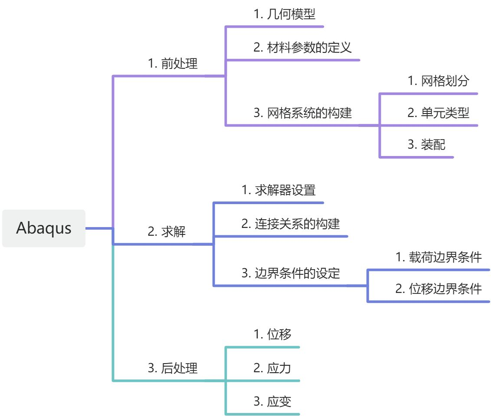
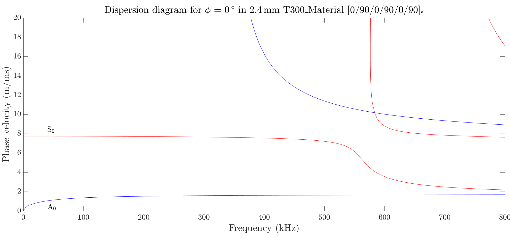
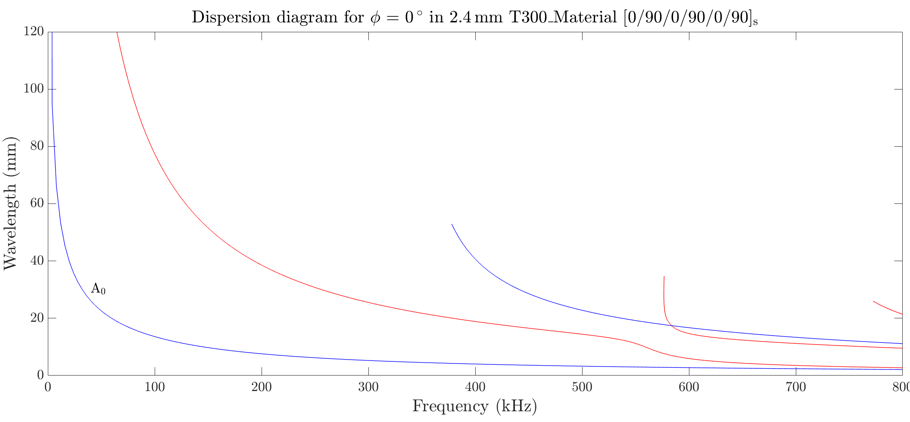

### Principle
#### Unit
Abaqus doesn't have a fixed unit system. So we need to choose a matching set of units for each quantity.

| 量纲 Dimension | 单位Units Kg-m-s | 单位Units Kg-mm-s | 单位Units T-mm-s-Mpa | 单位Units g-mm-s |
| :---: | :---: | :---: | :---: | :---: |
| 长度L | $ m $ | mm $ \rm = 10^{-3} m $ | mm $ \rm = 10^{-3} m $ | mm $ \rm = 10^{-3} m $ |
| 质量M | $ Kg $ | $ Kg $  | $ T $ (吨)  $ \rm 10^3Kg $ | g   $ \rm 10^{-3}Kg $ |
| 时间t | s | s | s | s |
| 温度T | K | K | K | K |
| 面积 $ A \sim L^2 $ | $ \rm m^2 $ | $ \rm mm^2 $ $ =  \rm 10^{-6} m^2 $ | $ \rm mm^2 $ $ =  \rm 10^{-6} m^2 $ | $ \rm mm^2 $ $ =  \rm 10^{-6} m^2 $ |
| 体积 $ V\sim L^3 $ | $ \rm m^3 $ | $ \rm mm^3 $ $ = \rm 10^{-9} m^3  $ | $ \rm mm^3 $ $ = \rm 10^{-9} m^3  $ | $ \rm mm^3 $ $ = \rm 10^{-9} m^3  $ |
| 力F | N(牛顿、牛)  $ =\rm \frac{Kg \cdot m}{s^2} $ | $ \rm \frac{Kg \cdot mm}{s^2} $ $ =\rm 10^{-3}N $ | $ \rm \frac{T \cdot mm}{s^2} $   $ =\rm N $ | $ \rm \frac{g \cdot mm}{s^2} $   $ =\rm 10^{-6} N $ |
| 密度ρ | $ \rm \frac{Kg}{m^3} = \frac{10^{-3}g}{cm^3} $ | $ \rm \frac{Kg}{mm^3} = \frac{10^{6}g}{cm^3} $ | $ \rm \frac{T}{mm^3} = \frac{10^{9}g}{cm^3} $ | $ \rm \frac{g}{mm^3} = \frac{10^{3}g}{cm^3} $ |
| 能量、焓、热量 $ \frac{M \cdot L^2}{t^2} $ | J(焦耳) $ =\rm N \cdot m = \frac{Kg \cdot m^2}{s^2} $ | $ \rm \frac{Kg \cdot mm^2}{s^2}  $ $ \rm = 10^{-6}J $ | $ \rm \frac{T \cdot mm^2}{s^2}  $   $ \rm = 10^{-3}J $ | $ \rm \frac{g \cdot mm^2}{s^2}  $ $ \rm = 10^{-9}J $ |
| 功率、热流量  $ \frac{M \cdot L^2}{t^3} $ | W(瓦)  $ =\rm\frac{J}{s} = \frac{Kg \cdot m^2}{s^3} $ | $ \rm \frac{Kg \cdot mm^2}{s^3}  $   $ \rm = 10^{-6}W $ | $ \rm \frac{T \cdot mm^2}{s^3}  $   $ \rm = 10^{-3}W $ | $ \rm \frac{g \cdot mm^2}{s^3}  $   $ \rm = 10^{-9}W $ |
| 压力、应力、模量 $ \frac{M}{t^2 \cdot L} $ | $ \rm Pa = \frac{N}{m^2} = \frac{Kg }{s^2\cdot m} $ | $ \rm \frac{Kg }{s^2\cdot mm} $   $ \rm 10^3Pa = kPa $ | $ \rm \frac{T }{s^2\cdot mm} $   $ \rm 10^6Pa = MPa $ | $ \rm \frac{g }{s^2\cdot mm} $   $ \rm Pa $ |

#### Processing






#### Mesh
For Guided wave (Lamb wave): The largest mesh element size was smaller **than 1/10** of the shortest incident wavelength.

### Operation skills
#### Visualization
Question: The result obtained by submitting a job in Abaqus often has mesh grid. Basically, these grid lines are unnecessary sometimes. So how to remove the mesh grid lines?

Method/Steps: 

    - open the result file in "Visualization".
    - Select the "Options" tab and click on the "Common" option.
    - "Common Plot Options" --> "Basic" --> "Visible Edges" --> Select "Free edges" or "No edges".

#### Materials
> $ T-mm-s-Mpa $
##### steel

| Properties      | Value                                                      | Abaqus                  |
|-----------------|------------------------------------------------------------|-------------------------|
| Denisity        | $ 7.85 g/cm^3 = 7850 kg/m^3 = 7.85 \times 10^{-9} T/mm^3 $ | $ 7.85 \times 10^{-9} $ |
| Young's modulus | $ 210 GPa = 210 000 MPa $                                  | $  210 000 $            |
| Poisson Ratio   | 0.3                                                        | 0.3                     |

##### aluminum

| Properties      | Value                                                      | Abaqus                  |
|-----------------|------------------------------------------------------------|-------------------------|
| Denisity        | $ 2.7 g/cm^3 = 2700 kg/m^3 = 2.7 \times 10^{-9} T/mm^3 $   | $ 2.7 \times 10^{-9} $ |
| Young's modulus | $ 70 GPa = 70 000 MPa $                                    | $  70 000 $            |
| Poisson Ratio   | 0.33                                                       | 0.33                     |

##### T300
unidirectional laminate [单向层压板]

Ref: 

[[1] Design of fiber-reinforced composite pressure vessels under various loading conditions]( https://www.sciencedirect.com/science/article/pii/S0263822302000375?via%3Dihub )

[2] Micromechanics Models for Viscoelastic Plain-Weave Composite Tape Springs

| Properties                                | Value |
|-------------------------------------------|-------|
| Elastic modulus in fiber direction (GPa)  | 181   |
| Elastic modulus in matrix direction (GPa) | 10.3  |
| In plane shear modulus (GPa)              | 7.17  |
| Major Poisson's ratio                     | 0.28  |

(Self-defined)

| Properties   | Value           | Abaqus |
|--------------|-----------------|--------|
| Mass density | 1600 $ kg/m^3 $ | 1.6e-9 |
| $ E_1 $      | 181 $GPa$       | 181000 |
| $ E_2 $      | 10.3 $GPa$      | 10300  |
| $ E_3 $      | 10.3 $GPa$      | 10300  |
| $ G_12 $     | 7.17 $GPa$      | 7170   |
| $ G_13 $     | 7.17 $GPa$      | 7170   |
| $ G_23 $     | 3.4 $GPa$       | 3400   |
| $ \nu_12 $   | 0.28            | 0.28   |
| $ \nu_13 $   | 0.28            | 0.28   |
| $ \nu_23 $   | 0.4             | 0.4    |

Dispersion curves @ Dispersion Calculator 











#### Export

注意导出out-of-plane的振动数据时，其方向不一定是z轴，特别是从外部文件导入的数据。