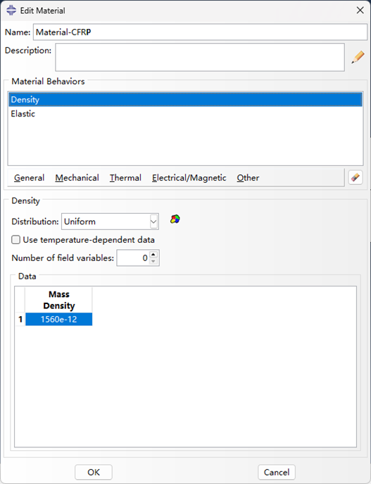
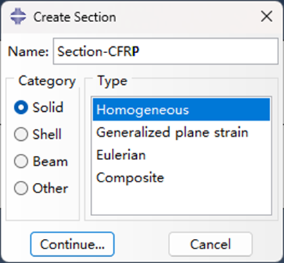
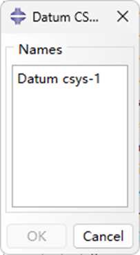

## 材料属性Material properties
$ E_1 = 128 GPa $, $ E_2 = E_3=82GPa $, $ G_{12}=G_{13}=4.7GPa $,  $ G_{23} = 3.44GPa $,  $ \nu_{12}=\nu_{13}=0.27 $,  $ \nu_{23}=0.2 $,  $ \rho = 1560 kg/m^3 $.

## 复合材料分层的模拟方式

> 思路：分割某两层材料？

### 网格单元偏移？

The damage is modeled using a volumn split method such that the FE nodes across the damage surfaces are aeperated by a small distance.

### 直接建模薄空气层

### 界面接触

## Tips

It should be stressed that if the delamination type of damage is located in the middle plane of the plate, it cannot be picked up by the A0 mode due to the zero-strain state of the middle plane [1]. 

Nodal spacing in the model far exceeded the nodal spacing requirement of 10 nodes per wavelength [2]. 

## Steps

Description: A quasi-isotropic laminate plate with a dimension of 450 mm × 450 mm × 1.8 mm is considered. The origin of the coordinate system is set at the center of the bottom of the plate. This 4-ply laminate has a stacking sequence [0/45/-45/90]. A rectangular shape representative delamination with a dimension of 20 mm × 20 mm is modeled at the center of the composite plate between the first layer and the adjacent second layer. The position of the PZT is located at (-125 mm, 125 mm). The excitation signal used in the numerical study is a 160-kHz narrow-band five-cycle sinusoidal tone burst modulated by a Hanning window. The excitation signal is introduced to the FE model through out-of-plane forces acting on the central FE nodes corresponding to the positions of the actuators.

### 模型创建
核心思想是创建一层cohesive layer，然后在装配体中merge mesh，选择boundary only，然后删除cohesive layer，这样就认为人为创造一个分层区域。
（1）Create Part: CFRP共有四层，总厚度为1.8 mm，单层厚度为0.45 mm.

（2）Partition Face面拆分，为传感器创建位置。创建线条1：（-225，125）-（225，125），线条2：（-125，-225）-（-125，225），两条线的交点创建为“传感器”集合。

选择对应的点，点击完成即可。

（3）Partition Cell：将模型沿厚度方向拆分，方便创建网格，此处拆分为1/2。拆分为其他值时，可以使用拆分面获得相应的驱动点之后再进行部件拆分，此处为1/2，可以直接利用线段中点。点击“Partition Cell”，选择“Point & Normal”，之后鼠标选择厚度方向的中点，选择正确的切线方向，完成厚度方向拆分。

### 材料属性定义（Module：Property）

（1）Create Material：创建材料，定义密度，弹性工程常数。

（2）创建截面

（3）分配截面属性（为了便于扩展，将厚度方向的每一层都创建为集合，方便后续分配材料方向等。），材料选择之前创建的材料。

### 网格定义，缺陷单元定义
（1）网格全局尺寸定义为0. 5mm，划分网格，共1620000单元。

（2）定义缺陷对应的网格单元集合

首先创建基准（基准定义到缺陷区域的中心），方便定义缺陷时进行选择。

创建缺陷对应的单元集合，工具-集-管理器，创建

根据网格单元大小和缺陷尺寸大小，计算缺陷单元相对于基准的分布之后选择对应的单元。

编辑网格

### 复制部件，重新定义集合，分配截面，注意层叠顺序
（1）复制部件1，作为第二层

（2）删除复制部件的集合，截面分配，重新定义集合和截面分配.

（3）创建第三层和第四层，无缺陷的部件层。沿厚度方向分割，分配截面，网格划分。
### 创建实例（Assembly）
（1）创建实例，选择自动偏移

（2）部件旋转，使含有缺陷的两层面对面；
（3）部件偏移，合成整个的碳纤维板；
### 合并实体
（1）合并实体

选择所有实例，点击确定。

### 创建一个基准，方便后续定义材料旋转方向。
### 网格-编辑网格-删除单元

### 材料方向分配/编辑

### Others
1. 定义激励信号：160kHz汉宁窗5周期调制波形
2. 定义分析步，显式动力学，时间步长1e-8，时间总长500e-6。
3. 创建场输出请求，均匀时间间隔，200，输出量为位移。
4. 创建集中力载荷。
5. 按需求创建边界条件。
6. 创建分析作业，提交分析。

## Reference

[1] Huo H, He J, Guan X. A Bayesian fusion method for composite damage identification using Lamb wave. Structural Health Monitoring. 2020;20(5):2337-2359.  doi:10.1177/1475921720945000

[2] Chiu W K, Rose L R F, Nadarajah N. Scattering of the fundamental anti-symmetric Lamb wave by a mid-plane edge delamination in a fiber-composite laminate[J]. Procedia Engineering, 2017, 188: 317-324. doi: 10.1016/j.proeng.2017.04.490