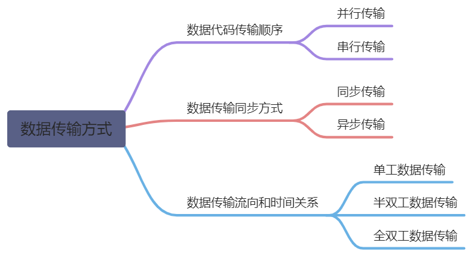
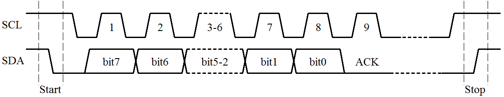
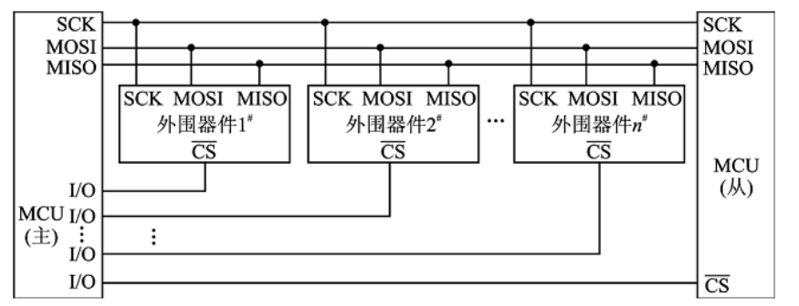
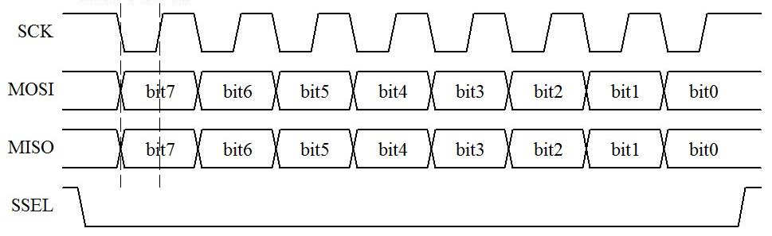
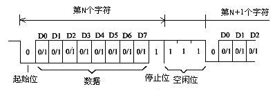
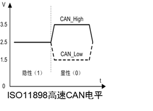
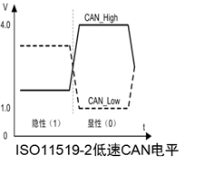
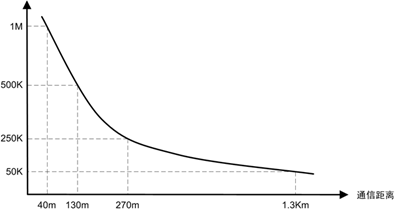

#### 1、并行传输
**概念**: 将数据以成组的方式在两条以上的并行信道上同时传输

**特点**:

* 收、发双方不存在字符同步的问题，不需要额外的措施来实现收发双方的字符同步;
* 传输速率较快、信息格式不要求固定格式、通信抗干扰能力差、传输距离小;
* 需要传输信道多，设备复杂，成本高;

#### 2、串行传输
**概念**: 数据码流以串行方式在一条信道上传输;

**特点**:

* 线路简单、成本较低;
* 易于实现，通畅在远距离传输时候使用;
* 为解决收、发双方字符同步，需外加同步措施;

#### 3、异步传输
**概念**: 信息被划分成小组独立传送。每次异步传输都以一个开始位开头，它通知接收方数据已经到达了；在传输结束时，一个停止位表示一次传输的终止.

**特点**: 
* 实现字符同步比较简单，收发双方的时钟信号不需要精确的同步;
* 每个字符增加了起、止的位，降低了信息传输效率;

#### 4、同步传输
**概念**: 将许多字符组成一个信息组，字符可以一个接一个地传输。在每组信息的开始要加上同步字符，如果没有信息要传输，则要填上空字符，同步传输不允许有间隙。在整个系统中，由统一的时钟控制发送端来发送空字符。接收端同样要求能识别同步字符，当见检测到有一串位和同步字符相匹配时，就认为开始一个信息帧，于是，把此后的BIT作为实际传输信息来处理。

**特点**: 

* 不需要对每个字符单独增加起、止的比特位，传输效率较高; 
* 与异步传输相比，在技术上更加复杂（需要实现位定时同步和帧同步）;

#### 5、数据传输流向和时间关系
* 单工方式: 在通信线路上，数据按单一方向传输。即两端通信是单向的，一个主动发送，一个被动接受。比如：广播电视。
* 半双工方式: 数据既可以在发送端发送或接受，也可以在接收端发送或接受，但是不能同时发送或接受数据。比如：对讲机。
* 全双工方式: 数据传输中，双方可以在同一时间接受和发送数据，比如打电话。

#### 6、常见的数据传输方式
单片机常见的片上资源有很多种，常用的有**IIC、SPI、UART/USART、CAN**等.

**（1）** IIC 

两线式串行总线，它是由数据线SDA和时钟线SCL构成的串行总线，可发送和接收数据。在CPU与被控IC之间、IC与IC之间进行双向传送，高速IIC总线一般可达400kbs以上。

**<u>连接线：</u>**

+ 时钟线SCL：在通信过程起到控制作用。 
+ 数据线SDA：用来一位一位的传送数据。 

**<u>通讯时序：</u>**

IIC通信过程由开始、结束、发送、响应、接收五个部分构成.

* （在发送、接收数据的时候）当SCL为高电平时，SDA线不允许变化；当SCL线为低电平时，SDA线可以任意0、1变化.
* （在任意时候）只有当SCL为高电平时，IIC电路才对SDA线上的电平（0或者1）进行记录，当SCL线为低电平时，无论SDA是高还是低，IIC电路都不对SDA进行采样.
* IIC总线的SDA和SCL两条信号同时处于高电平时，规定为总线的空闲状态。此时各个器件的输出级场效管均处在截止状态，即释放总线，由两条信号线各自的上拉电阻把电平拉高.
* 开始信号：当SCL为高期间，SDA由高到低的跳变；启动信号是一种电平跳变时序信号，而不是一个电平.
* 停止信号：当SCL为高期间，SDA由低到高的跳变；停止信号也是一种电平跳变时序信号，而不是一个电平信号.

**<u>使用场合</u>**：主要用在芯片级进行短距离通信，如EEPROM存储芯片AT24C02就是IIC通讯

**（1）** SPI

串行外围设备接口，是一种高速全双工的通信总线。优点是通讯简单、数据传输速率快、缺点是没有指定的流控制，没有应答机制确认是否接收到数据，所以跟IIC总线协议比较在数据可靠性上有一定的缺陷。

**<u>连接线：</u>**

(1) **CS**：片选信号线，用于选中SPI从设备。每个从设备独立拥有这条信号线，占据主机的一个引脚。设备的其他总线是并联到SPI主机的，即无论多少个从设备，都共同使用这3条总线。当从设备上的nSS引脚被置拉低时表明该从设备被主机选中。

(2) **SCK**：时钟信号线，通讯数据同步用。时钟信号由通讯主机产生，它决定了SPI的通讯速率。

(3) **MOSI**：主机(数据)输出/从设备(数据)输入引脚，即这条信号线上传输从主机到从机的数据。

(4) **MISO**：主机(数据)输入/从设备(数据)输出引脚，即这条信号线上传输从机从到主机的数据主从机通过两条信号线来传输数据，那么自然是全双工通讯的了。之前的I2C通讯，数据只在一条SDA线上传输，主从机数据交互只能采用半双工。

**<u>通信时序：</u>**

在一个SPI时钟周期内，会完成如下操作：1) 主设备通过MOSI线发送1位数据，从设备通过该线读取这1位数据； 从设备通过MISO线发送1位数据，主设备通过该线读取这1位数据；数据发送和数据采样由上升沿或下降沿控制，由用户选择。

**<u>使用场合</u>**：显示模组、时钟芯片、存储芯片、温度传感器等众多器件都有使用SPI接口通信。

**（3）** 串口

在一条信号线上将数据一个比特一个比特地逐位进行传输的通信模式。串口按电气标准及协议来划分，包括RS-232-C、RS-422、RS485、RS232等。

连接线：RXD、TXD、GND等。

**<u>时序：</u>**

**<u>电平标准</u>**：

+ 5V TTL：逻辑1：2.4V~V；逻辑0：0~0.5V；
+ RS 232：逻辑1：-15V~-3V；逻辑0：3~15V；
+ RS 485：逻辑“1”以两线间的电压差为-（2~6）V；逻辑“0”以两线间的电压差为+（2~6）V；

**<u>RS-232与RS-485对比</u>**

+ **抗干扰性**：RS485 接口是采用平衡驱动器和差分接收器的组合，抗噪声干扰性好。RS232 接口使用一根信号线和一根信号返回线而构成共地的传输形式，这种共地传输容易产生共模干扰。
+ **传输距离**：RS485 接口的最大传输距离标准值为 1200 米（9600bps 时），实际上可达 3000 米。RS232 传输距离有限，最大传输距离标准值为 50 米，实际上也只能用在 15 米左右。
+ **通信能力**：RS-485 接口在总线上是允许连接多达128个收发器，用户可以利用单一的 RS-485 接口方便地建立起设备网络。RS-232只允许一对一通信。
+ **传输速率：**RS-232传输速率较低，在异步传输时，波特率为 20Kbps。RS-485 的数据最高传输速率为 10Mbps 。
+ **信号线：**RS485 接口组成的半双工网络，一般只需二根信号线。RS-232 口一般只使用 RXD、TXD、GND 三条线

**应用场合：**

* 单纯的UART只适合于近距离的通信，很多芯片也具有UART，所以可以用作芯片级的数据交换；
* 232是一对一通信的,传输距离 25米以内;
* 485可以一对多，传输距离可达 1200米以上；

**（4）** CAN总线

CAN（Controller Area Network）即控制器局域网，是一种能够实现分布式实时控制的串行通信网络。

**电平标准：**

**连接线：**CANH、CANL

**传输距离：**

**比较：**

| **CAN总线与RS485的比较** | | |
| --- | --- | --- |
| 项目 | CAN总线 | RS485 |
| 速度与距离 | 1Mbps下不超过40m5Kbps下不超过10Km | 1Mbps下不超过100m最低速率下不超过1.2Km |
| 总线利用率 | 优先级自动仲裁，利用率高 | 采用轮训方式，利用率低 |
| 错误检测机制 | 控制器自带校验机制，保障底层数据传输正确 | 只用物理层规范，无数据链路层规定，数据传输错误率高 |
| 开发成本 | 硬件成本较高，软件开发灵活，时间成本低 | 硬件成本较低，开发难度较大 |

**（5）** 总结

每种通信方式所出现的时间不同，使用场合不同，用户的要求和方案也不同，无法做到一种通信协议覆盖所有的应用环境和客户群体。不同的通信方式各有优点，使用时可以根据成本、通信方式特点选取最适合方案。

