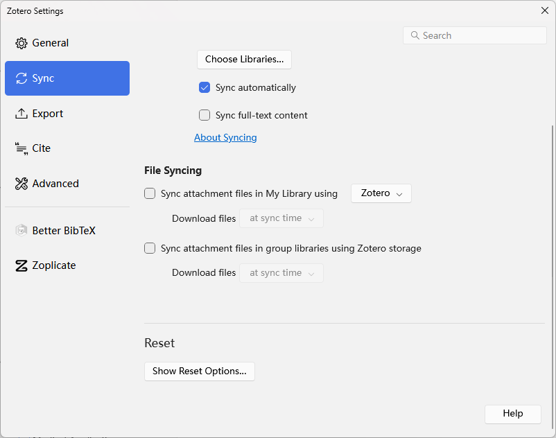
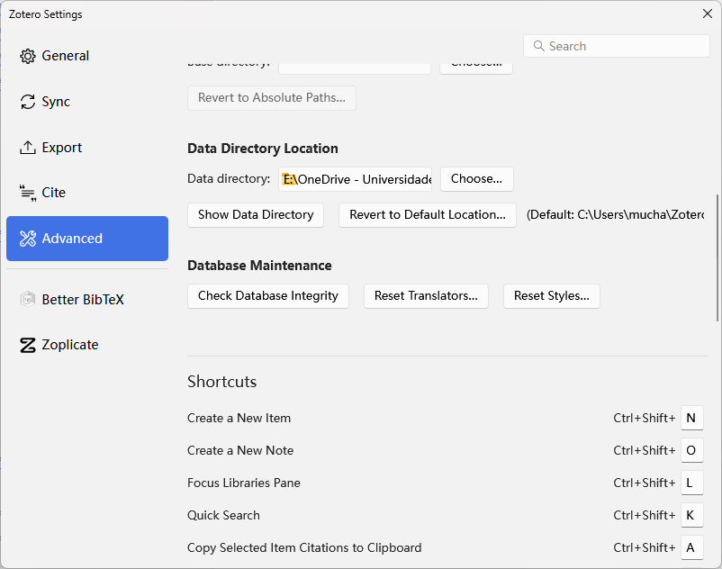
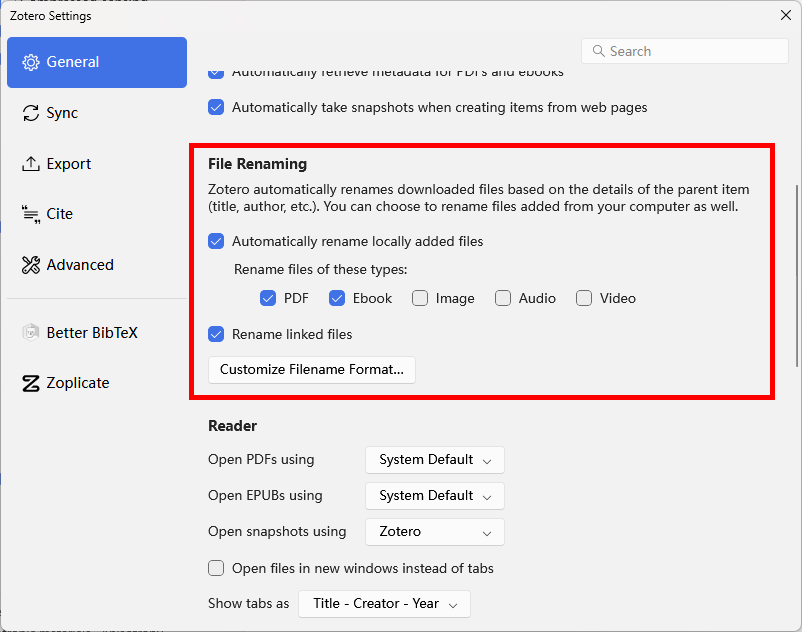
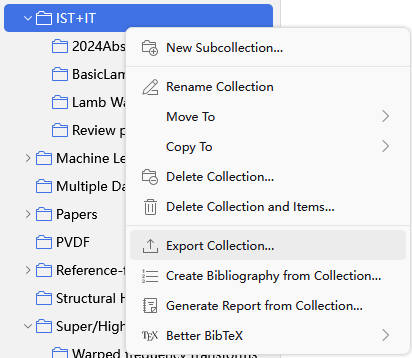
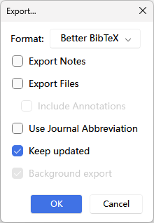
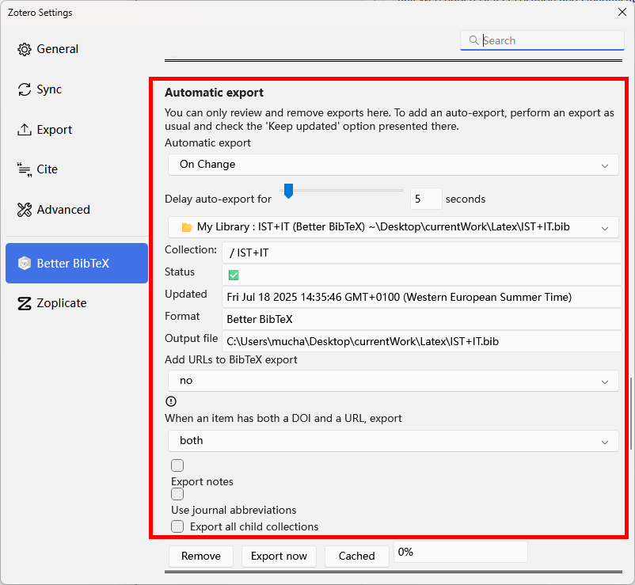
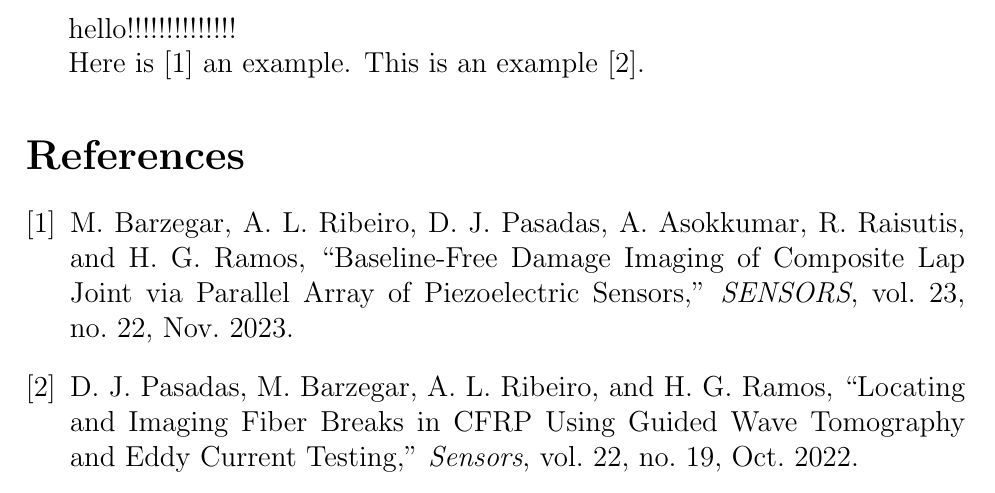

## Zotero & Onedrive

### Zotero setting

#### Disable File Syncing

去掉File Syncing下的两个对勾。



#### Base Directory

将存储文件夹改为Onedrive内部文件夹。



#### File Renaming Rules



### Chrome Plugin

[Zotero Connector](https://chromewebstore.google.com/detail/zotero-connector/ekhagklcjbdpajgpjgmbionohlpdbjgc?hl=en&pli=1)

## Texstudio & Zotero

### Install Texlive and Texstudio

[texlive](https://www.tug.org/texlive/)

[texstudio](https://www.texstudio.org/)

[TeXlive and TeXstudio](https://www.bilibili.com/opus/417734459151899358?from=search)

### Install Betterbib in Zotero

[Downlaod .xpi files for installation](https://retorque.re/zotero-better-bibtex/)

### Export .bib and keep update

Export references as .bib file, enable the keep update button, save this file at the texstudio folder. 

> Export collection



> Export options: enable "Keep updated" 



> Manage auto-update



### Cite the reference in texstudio

> An example

```
\documentclass[12pt]{article}
\usepackage[english]{babel}
\begin{document}
	hello!!!!!!!!!!!!!!

Here is \cite{barzegarBaselineFreeDamageImaging2023} an example. This is an example \cite{pasadasLocatingImagingFiber2022}.

\bibliographystyle{IEEEtran}
\bibliography{IST+IT.bib}

\end{document}
```



## References

[1. TeXstudio简易使用指南.](https://docs.mathcrowd.cn/howtos/texstudio_guide.html)

[2. 配置Texstudio与Zotero.](https://medium.com/@yjy303030/%E6%96%87%E7%8C%AE%E7%AE%A1%E7%90%86zotero-onedrive-texstudio-d182d4904f1)

[3. 如何使用Zotero优雅地管理文献](https://zhuanlan.zhihu.com/p/615902028)
